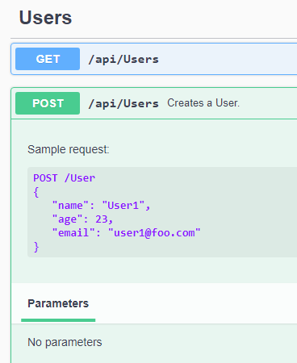

# HahnServer

## Backend of Hahn Application.

- Web Solution with RestEndpoints;
- business logic, the data / persistence layer and the web project;
- The WebApi accepts and returns application/json data;
- using fluentValidation;
- The main goal should be: A User can create his Profile and select some assets he wants to track. 
- Always when the user opens his tracked asserts he should get the live data from the saved asserts of his profile.
- API described with swagger (Swashbuckle v5)
- To save the data use entityframework core 5.0 and entityframework in memory database.
- Backend has to be deployed into docker container.

It has swagger.
